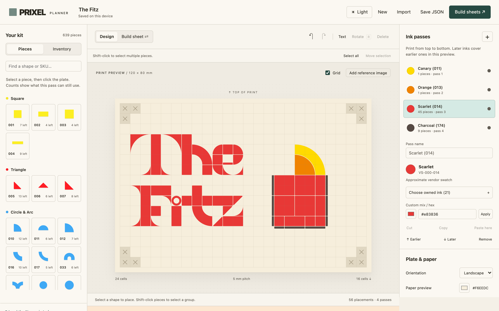
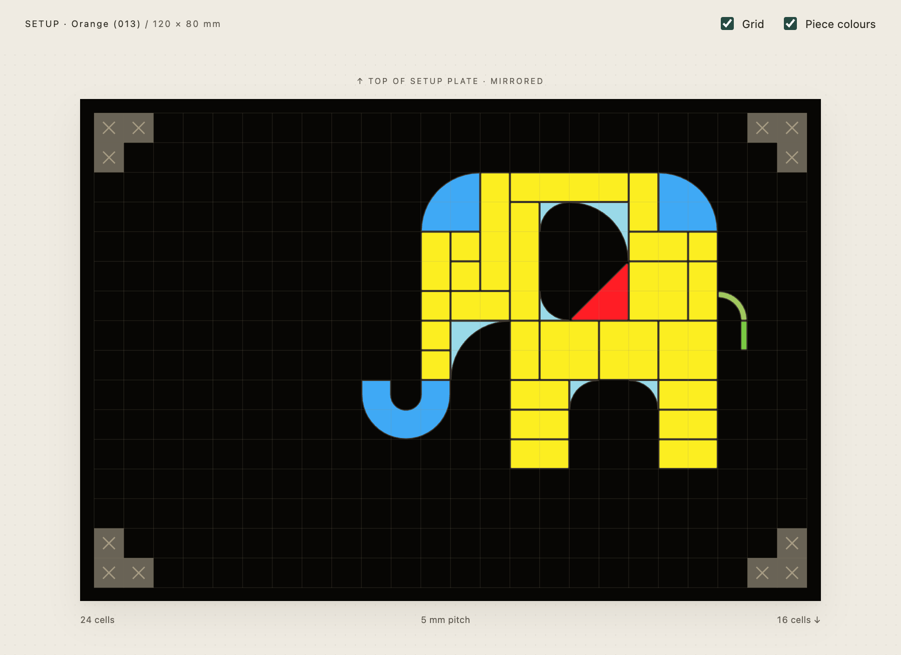
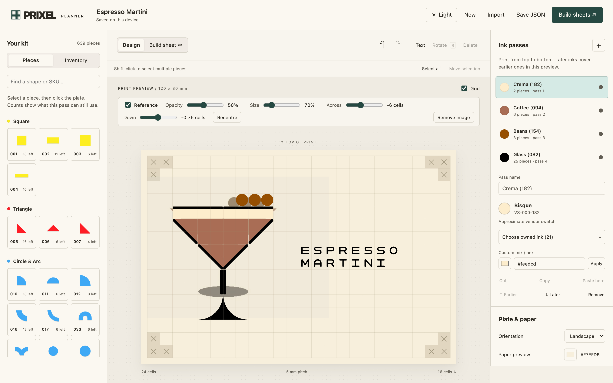
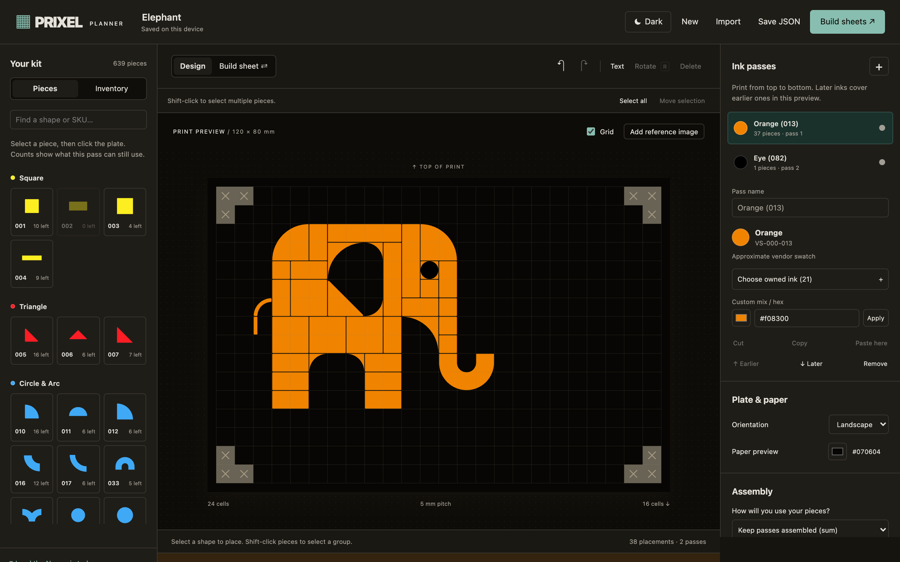

# PRIXEL planner

A workbench for the [PRIXEL](https://prixel.com) modular stamp kit. Lay out a
design on the 24×16 plate, split it into ink passes, check it against the
pieces you own, and print mirrored build sheets for setting the plate.

Made by a PRIXEL owner, shared with PRIXEL's blessing. Not an official PRIXEL
product.



<table>
<tr>
<td width="50%"></td>
<td width="50%"></td>
</tr>
<tr>
<td><b>Build sheet.</b> The plate mirrored as you set it, with every piece in the colour it's moulded in, so you can find it in the box.</td>
<td><b>Trace a reference.</b> Put a picture behind the plate, then fade, resize and move it. It's never printed or exported.</td>
</tr>
</table>



**Dark mode** follows your system, or pin Light or Dark. The paper keeps its true colour, because it's a print preview.

## Run

Needs Node 20 or newer.

```sh
npm install
npm run dev
```

Open http://localhost:5173. The first `dev`, `build` or `test` downloads the
PRIXEL Mono font from PRIXEL's own store and generates the letter outlines —
the font is never stored in this repo (see `NOTICE.md`). After that it is
cached and everything works offline.

The app itself makes no network requests: no accounts, analytics or backend.
Your work stays in the browser; use **Save JSON** to keep a copy.

## Compose

- Choose a piece, then click the grid. Drag existing pieces to move them.
- **R** rotates clockwise, **Delete** removes, **Escape** clears selection.
- Focus the plate to use arrow keys. They move the selected piece, or a cell
  cursor. **Enter** places the chosen piece, or selects a piece under the cursor.
- **Ctrl/Cmd Z** undoes; **Ctrl/Cmd Shift Z** or **Ctrl Y** redoes. Changes to
  settings and inventory are included. New/import/sample actions are undoable.
- Choose an ink pass to edit it. Earlier/later changes print order. Visibility
  changes only the preview and does not release inventory.
- Portrait rotates the whole plate. Saved placements always use the canonical
  24-column, 16-row plate: zero-based coordinates, top-left of the rotated
  footprint, clockwise quarter-turns. There is no per-piece reflection.
- Edit owned counts under **Inventory**. Pieces without vendor SVGs remain
  unavailable regardless of their count. Palette groups use families, not hex.

## Import and move a group

After choosing an import file, select **Replace composition** or **Add to current
pass**. Replacement retains the old whole-project behaviour and is undoable.
Adding combines all source passes into the active destination pass, uses its ink
and the current project's inventory, and normalises the motif's bounding box.
Source coordinates are discarded; visible orientation is preserved across
landscape/portrait plates. Imported placements receive fresh IDs.

A floating group stays separate from the saved composition. Drag to position,
use arrow keys to nudge, and **R** to rotate the whole group. **Enter**, a click
on the plate, or **Place group** commits it. A drag release only moves the ghost.
**Esc** or **Cancel** discards the transaction. One undo reverses a committed
group. Other editing controls are disabled until placement or cancellation.

Validation runs live for off-plate pieces, blocked cells, internal collisions,
collisions with the destination pass, missing artwork, and inventory in the
active sum/max mode. Invalid groups cannot commit. The PX-017 arc and PX-012
disc may overlap across ink passes, but their physical footprints collide when
flattened into one pass; visual nesting is not an exception.

**Shift-click** toggles pieces in a selection. **Select all** (or Ctrl/Cmd A with
the plate focused) selects the active pass. **Move selection**, dragging a
multi-selection, arrow keys, or R starts the same floating transaction.
Existing pieces retain their IDs and release their original footprints and
inventory during validation. Cancellation restores their original positions.

Rotation uses the group's centre. If its width and height have different
odd/even parity, an exact quarter-turn would land on half-cells. The entire
group snaps together to whole cells; individual offsets are preserved. Four
rotations return exactly to the starting position without accumulating drift.

## Owned inks

**Choose owned ink** offers the 21 colours (22 pads) in
`assets/owned-inks.json`, with swatches, names and VS codes. The picker resolves
measured `printed_hex` first and `vendor_hex` second, checking the main ink
catalogue as well as the owned snapshot. `pad_sample_hex` is never a fallback.
All current vendor swatches are labelled approximate. No measured values are
invented or written by the app.

Choosing an owned colour stores its `inkSku` alongside the preview hex. Rendering
and exports prefer its measured swatch if one becomes available later. Older
raw-hex projects keep their existing colour. Off-palette colours show the two
nearest owned screen swatches; selection is explicit, never automatic. For
`#C0392B` those suggestions are Scarlet and Camellia. Ranking uses Euclidean
[Oklab distance](https://bottosson.github.io/posts/oklab/), not a pigment/print prediction.

**Custom mix / hex** accepts six hex digits, with or without `#`; use **Apply**
or Enter. The colour input also remains available. Custom edits clear any stock
ink identity and stay unmeasured. They do not create mixing recipes.

Bronze (VS-000-094) is marked **oil-based, no reinker** in the picker and on
selected-ink build sheets. It cannot be mixed with the other owned water-based
inks. The picker does not infer measured print colour from a brand swatch.

## Assembly and output

**Keep passes assembled (sum)** is the default. All passes reserve their pieces
at once. The UI warns when more than two plates would be needed.
**Reuse between passes (max)** counts the highest per-pass requirement for each
SKU; dismantle and clean pieces between passes. Remaining palette counts show
how many more pieces the active pass can use under the chosen policy.

**Design** overlays passes in print order. **Build sheet** is a read-only,
mirrored view of the active pass. It does not mutate the saved design.

- **Export this pass as SVG** downloads a self-contained mirrored SVG, exactly
  120×80 mm landscape or 80×120 mm portrait. All glyphs are vector outlines.
- **Build sheets** downloads a self-contained HTML document with one sheet per
  ink pass, readable labels, external pick-lists, assembly policy, orientation
  markers and a 50 mm calibration ruler. Open it in a browser, print at actual
  size / 100%, and disable fit-to-page. Browser Save as PDF is supported.
- Invalid projects can be exported for review; sheets are marked DRAFT when
  inventory or geometry checks fail. Export never silently repairs a design.

## Negroni study

The initial sample is a portrait cream card with a red glass, nested orange
quarter-disc and yellow arc, and seven PRIXEL Mono letters on a fourth pass.
Red prints after orange and yellow. It uses real kit pieces at native size;
no stamp is scaled up. The perforated paper edge is a preview treatment.

## Mono text

**Text** opens a live multiline draft on the active pass. Type or paste text,
choose a starting cell (or click the plate), and select left, centre or right
alignment. The column anchors that alignment; the row is the top of the block.
Spaces advance a cell, blank lines consume a row, and lines never wrap silently.
The limits are 24 columns and 16 rows including accents; the visible plate bounds
also apply, so portrait lines can occupy at most 16 columns.

**Place text** or **Ctrl/Cmd Enter** commits the whole draft in one undo step.
**Esc** cancels without changing the composition. Committed letters are normal
pieces: Shift-select and move them together using the group controls.

All 120 supplied outlines use the same native scale as the shape SVGs. The 17
digital glyphs without physical pieces are explicitly refused. Lowercase uses
the same pieces as uppercase. Inventory counts 56 physical pools totalling 323
pieces, against the booklet's stated 324; counts remain editable. Rotated
variants share their pool across text, manual moves, imports and ink passes.
For example, MINIMUM uses three M/W pieces, two H/I, one N/Z and one C/U.

Accented lines reserve one extra row above the letters. Grave, circumflex,
tilde and diaeresis use their physical pools (diaeresis shares the colon).
Acute uses the U+2019 quote piece and warns that it prints noticeably high:
4.1 mm above the letter versus 2.0 mm for a true grave. Quotes and acute
substitutes share four pieces; grave, circumflex and tilde each have two.
Dedicated Ç/ç uses its own single piece. The live census and validation include
accent pieces, footprint collisions, blocked corners, bounds and the active
inventory policy. No unsupported character is silently discarded on commit.

Projects now save schema version 2 with physical-pool inventory keys. Version 1
projects retain placements and shape counts and receive the published Mono
case counts. Before upgrading an autosaved project, its original JSON is kept
in localStorage at `prixel-planner-v1-before-mono-v2`. Existing per-letter Mono
counts cannot describe the shared pools; review the new Inventory after migration.
The older `npm run glyphs` command only regenerates the legacy Negroni asset;
the app now reads `assets/mono-glyphs.json` and `assets/mono-case.json`.

## Provisional hardware assumptions

- L-triomino corner coordinates live in `assets/catalogue.json` under
  `grid.blocked_cells`, with a profile ID/version. They are inferred, unmeasured.
- Per-SKU `footprint_cells` explicitly model provisional rectangular footprints.
  Hollow artwork does not permit overlapping physical pieces.
- Saved profile versions are retained and compared with the current profile;
  imported and loaded projects are always revalidated against current data.
- Vendor artwork face-versus-impression orientation is unconfirmed. The app
  consistently treats artwork as the design appearance and mirrors setup output.
  Confirm this convention with an asymmetric physical stamp before production.
- Ink and paper hex values are preview colours, not measured swatches. Later
  passes cover earlier ones in the preview; physical overprint is untested.
- True physical print size still needs checking on the actual printer. The
  browser tests verify SVG dimensions and the ruler's CSS dimensions.

## Verify

```sh
npm run build
npm test
python3 scripts/check-consistency.py
npx playwright install chromium  # once, if no browser is installed
npm run dev                      # keep running in another terminal
npm run test:browser
```

`PLAYWRIGHT_CHROMIUM_EXECUTABLE_PATH` can point to an existing Chromium binary.
Browser checks cover composition, drag/keyboard input, validation, layer order,
undo/redo, persistence, safe import, exports, and mobile layout. Screenshots and
a sample print PDF are written to ignored `test-results/`.

`src/model.ts` contains geometry, inventory, validation, and import parsing,
independent of React. `src/groups.ts` provides transactional group transforms;
`src/inks.ts` resolves owned swatches and screen-colour matches;
`src/mono.ts` maps physical pools and `src/text.ts` lays out text and accents. `src/art.ts` uses the existing vendor SVG loader;
`src/export.ts` creates SVGs and standalone print documents.

## Source documents

- [Build brief](docs/build-brief.md)
- [Hardware contract](docs/prixel-spec.md)
- [Reviewed plan and resolutions](docs/plan-review-request.md)
- [Canonical catalogue](assets/catalogue.json)
- [Future colour system](docs/colour-system.md), not implemented in v1
- [Third-party asset restrictions](NOTICE.md)

This repository contains vendor artwork and a non-commercial font. Keep its
existing private distribution restrictions. No auto-tracing,
45-degree press rotation, sharing, or multiplayer is included.
